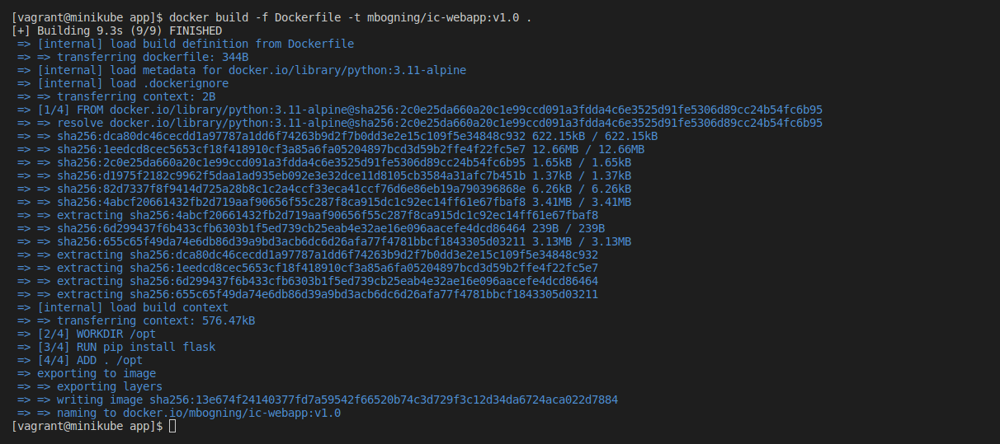

# PROJET FINAL DEVOPS. 

## **1) Introduction**

La société **IC GROUP** dans laquelle vous travaillez en tant qu’ingénieur Devops souhaite mettre sur pied un site web vitrine devant permettre d’accéder à ses 02 applications phares qui sont :  

1) Odoo et 
1) pgAdmin 

**Odoo**, un ERP multi usage qui permet de gérer les ventes, les achats, la comptabilité, l’inventaire, le personnel …  

Odoo est distribué en version communautaire et Enterprise. ICGROUP souhaite avoir la main sur le code et apporter ses propres modifications et customisations ainsi elle a opté pour l’édition communautaire.  Plusieurs versions de Odoo sont disponibles et celle retenue est la 13.0 car elle intègre un système de LMS (Learning Management System) qui sera utilisé pour publier les formations en internes et ainsi diffuser plus facilement l’information.  

Liens utiles : 

- Site officiel :[ https://www.odoo.com/ ](https://www.odoo.com/) 
- GitHub officiel:[ https://github.com/odoo/odoo.git ](https://github.com/odoo/odoo.git) 
- Docker Hub officiel :[ https://hub.docker.com/_/odoo ](https://hub.docker.com/_/odoo) 

**pgAdmin** quant à elle devra être utilisée pour administrer de façon graphique la base de données PostgreSQL crée précédemment. 

- Site officiel :[ https://www.pgadmin.org/ ](https://www.pgadmin.org/) 
- Docker Hub officiel:[ https://hub.docker.com/r/dpage/pgadmin4/ ](https://hub.docker.com/r/dpage/pgadmin4/) 

Le site web vitrine a été conçu par l’équipe de développeurs de l’entreprise et les fichiers y relatifs se trouvent dans le repo suscité : [ https://github.com/sadofrazer/ic-webapp.git ](https://github.com/sadofrazer/ic-webapp.git) . Il est de votre responsabilité de conteneuriser cette application tout en permettant la saisie des différentes URL des applications (Odoo et pgadmin) par le biais des variables d’environnement. 

Ci-dessous un aperçu du site vitrine attendu. 


**NB :** L’image** créée devra permettre de lancer un container permettant d’héberger ce site web et ayant les liens adéquats permettant d’accéder à nos applications internes 


### **2) Conteneurisation de l’application web.** 

## **a. Commencez par créer un fichier nommé Dockerfile sans extension.**

```bash
   # Utilisation de l'image de base Python 3.11 Alpine pour sa légèreté
   FROM python:3.11-alpine
   
   # Définition du répertoire de travail dans le conteneur
   WORKDIR /opt
   
   # Installation de Flask
   RUN pip install flask
   
   # Exposition du port 8080, utilisé par défaut par l'application
   EXPOSE 8080
   
   # Création de variables d'environnement pour configuration externe
   ENV ODOO_URL=https://www.odoo.com
   ENV PGADMIN_URL=https://www.pgadmin.org
   
   # Définition du point d'entrée, lance l'application
   ENTRYPOINT ["python", "app.py"]
```
Ce Dockerfile définit une image de base légère (Alpine), installe les dépendances nécessaires, expose le port de l'application, définit des variables d'environnement pour une configuration flexible et configure le conteneur pour lancer votre application au démarrage.

## **b. Commencez par créer un fichier nommé Dockerfile sans extension.**
Exécutez la commande suivante dans le terminal, à l'emplacement du Dockerfile, pour construire l'image Docker de l'application :
```bash
   # Utilisation de l'image de base Python 3.11 Alpine pour sa légèreté
   docker build -f Dockerfile -t mbogning/ic-group:v1.0 .
```


